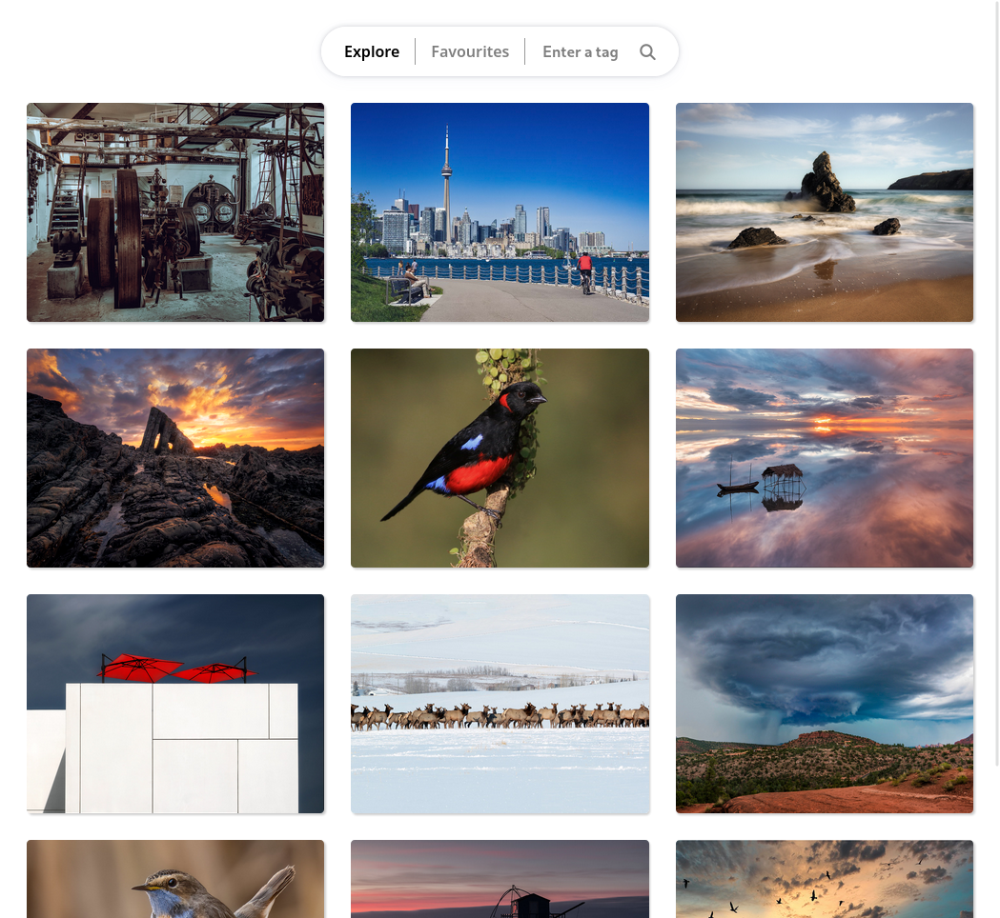

# Infinite Scroll Gallery

Infinite scroll gallery project created using React.js

## Features

- Explore page to browse photos from Flickr home page
- Search functionality that lets users search photos by a specific tag
- Infinite scroll to load more photos as the user scrolls down the page
- Ability to add/remove images to/from favourites
- Favorites page to view saved photos (local browser storage is being used)
- Loading spinner that indicates when new photos are being fetched
- Proper responsive UI for all screens

## UI Demo



## Project Setup

Run the following command from the root directory

```console
cd infinite-scroll & npm install
```

Once all the dependencies were installed start the app

```console
npm run start
```

Although the API key is provided, you can change it in .env file in root directory

```console
REACT_APP_API_KEY=<your Flickr API key>
```
